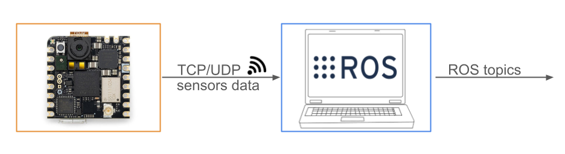
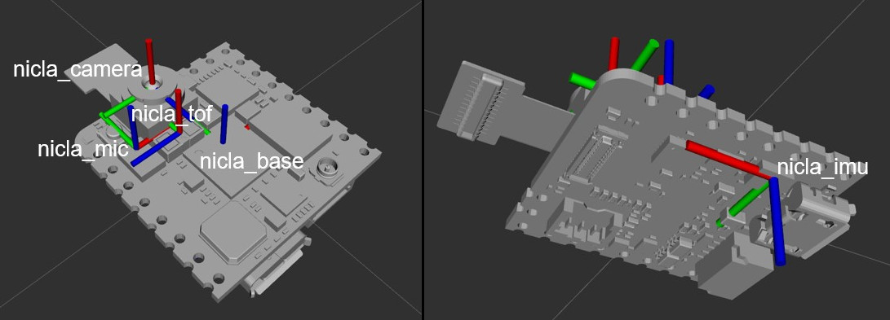

# :rocket: Nicla Vision ROS2 package :rocket: 
A ROS2 interface for the Arduino Nicla Vision board

[](https://build.ros2.org/job/Jdev__nicla_vision_ros2__ubuntu_noble_amd64/)
[](https://build.ros2.org/job/Hdev__nicla_vision_ros2__ubuntu_jammy_amd64/)



-------------------

## Description

This ROS package enables the [Arduino Nicla Vision](https://docs.arduino.cc/hardware/nicla-vision/) board to be ready-to-use in the ROS world! :boom:

The implemented architecture is described in the above image: the Arduino Nicla Vision board streams the sensors data to a ROS-running machine through TCP/UDP socket. This package will be running on the ROS-running machine, allowing to deserialize the received info, and stream it in the corresponding ROS topics 

Here a list of the available sensors with their respective ROS topics:
- **2MP color camera** streams on
    - `/nicla/camera/camera_info` 
    - `/nicla/camera/image_raw`
    - `/nicla/camera/image_raw/compressed` 
- **Time-of-Flight (distance) sensor** streams on:
    - `/nicla/tof`
- **Microphone** streams on:
    - `/nicla/audio` 
    - `/nicla/audio_info`
    - `/nicla/audio_stamped`
- **Imu** streams on:
    - `/nicla/imu`

The user can easily configure this package, by launch parameters, to receive sensors data via either UDP or TCP socket connections, specifying also the socket IP address. Moreover, the user can decide which sensor to be streamed within the ROS environment. 
In this repository you can find the Python code optimised for receiving the data by the board, and subsequently publishing it through ROS topics.

## Table of Contents 
1. [Installation](#installation)
2. [Usage](#usage)
3. [Package List](#package-list)
4. [Video](#video-demonstration)
5. [License](#license)
6. [Cite](#citation)
   
-------------------

# Installation
Step-by-step instructions on how to get the ROS package running

Binaries available for `humble` and `jazzy`:  
`sudo apt install ros-$ROS_DISTRO-nicla-vision-ros`  
For ROS1, check https://github.com/ADVRHumanoids/nicla_vision_ros.git

### Source installation
Usual `colcon` build:
```bash
$ cd <your_workpace>/src
$ git clone https://github.com/ADVRHumanoids/nicla_vision_ros2.git
$ cd <your_workpace>
$ colcon build
$ source <your_workpace>/devel/setup.bash
```

## Arduino Nicla Vision setup
After having completed the setup steps in the [Nicla Vision Drivers repository](https://github.com/ADVRHumanoids/nicla_vision_drivers.git), just turn on your Arduino Nicla Vision. 
When you power on your Arduino Nicla Vision, it will automatically connect to the network and it will start streaming to your ROS-running machine.

## Optional Audio Recognition with VOSK
It is possible to run a speech recognition feature directly on this module, that will then publish the recognized words on the `/nicla/audio_recognized` topic. At the moment, [VOSK](https://alphacephei.com/vosk/) is utilized. Only Arduino version is supported.
#### VOSK setup
1. ```pip install vosk```
2. Download a VOSK model https://alphacephei.com/vosk/models
3. Check the `recognition` arguments in the ```nicla_receiver.launch``` file

### Note
We rely on the [audio_common_msgs](https://github.com/ros-drivers/audio_common/tree/master/audio_common_msgs) for the microphone data. Nevertheless, such package is not available as binary for ros2 yet. Hence, for now, we have copy-pasted the messages in this repo itself.

# Usage 
Follow the below steps for enjoying your Arduino Nicla Vision board with ROS2!

## Run the ROS2 package
-  Launch the package:
    ```bash
    $ ros2 launch nicla_vision_ros2 nicla_receiver.launch receiver_ip:="x.x.x.x" connection_type:="tcp/udp" <optional arguments>
    ```
    - Set the `receiver_ip` with the IP address of your ROS-running machine.
        You can get this IP address by executing the following command:
        ```bash
        $ ifconfig
        ```
        and taking the "inet" address under the "enp" voice.
    - Set the socket type to be used, either TCP or UDP (`connection_type:="tcp"` or `"udp"`).
    
    Furthermore, using the `<optional arguments>`, you can decide:
    - which sensor to be streamed in ROS2

      (e.g. `enable_imu:=true enable_range:=true enable_audio:=true enable_audio_stamped:=false enable_camera_compressed:=true enable_camera_raw:=true`), and
    - on which socket port (default `receiver_port:=8002`).

    Once you run it, you will be ready for receiving the sensors data

## Simulated board 

- For simulating the Arduino Nicla Vision in Gazebo and Rviz:
     ```bash
    $ ros2 launch nicla_vision_ros2 nicla_sim.launch.py <optional arguments>
    ```
    Using the `<optional arguments>`, you can decide if to run the simulation in Gazebo or in Rviz, and which sensor to simulate (everything set to true as default).

  
    
## Optional Micropython Version
**Note** this version is not supported and maintained anymore, we defitively moved to the Arduino version.  

If you want to use the micropython driver of the nicla (after setup it accordingly), simply run the `nicla_receiver.launch` with `driver_version:=micropython` as argument.

# Video Demonstration

https://github.com/ADVRHumanoids/nicla_vision_ros/assets/26459008/a3eaf921-02ea-4482-80a0-5830a338eb74

<!-- Raw video: https://github.com/ADVRHumanoids/nicla_vision_ros/assets/63496571/699b265c-3f6a-4a9d-8d6c-fccf6bd39227 -->

# Package List
Here some useful links:

- [Nicla Vision Drivers repository](https://github.com/ADVRHumanoids/nicla_vision_drivers.git)
- [Nicla Vision ROS repository](https://github.com/ADVRHumanoids/nicla_vision_ros.git)
- [Nicla Vision ROS2 repository](https://github.com/ADVRHumanoids/nicla_vision_ros2.git)

# License
Distributed under the Apache-2.0 License. See LICENSE for more information.

# ROSCon24 Talk
- Video https://vimeo.com/1026030054
- Slides https://roscon.ros.org/2024/talks/Unlocking_the_Potential_of_the_Nicla_Vision_Board_with_ROS-ROS2.pdf
- 
# Citation 
:raised_hands: If you use this work or take inspiration from it, please cite:
```bibtex
@inproceedings {DelBianco2024,
  author = {Del Bianco, Edoardo and Torielli, Davide and Rollo, Federico and Gasperini, Damiano and Laurenzi, Arturo and Baccelliere, Lorenzo and Muratore, Luca and Roveri, Marco and Tsagarakis, Nikos G.},
  booktitle={2024 IEEE-RAS 23rd International Conference on Humanoid Robots (Humanoids)}, 
  title = {A High-Force Gripper with Embedded Multimodal Sensing for Powerful and Perception Driven Grasping},
  year={2024},
  volume={},
  number={},
  pages={},
  doi={}
}
```
